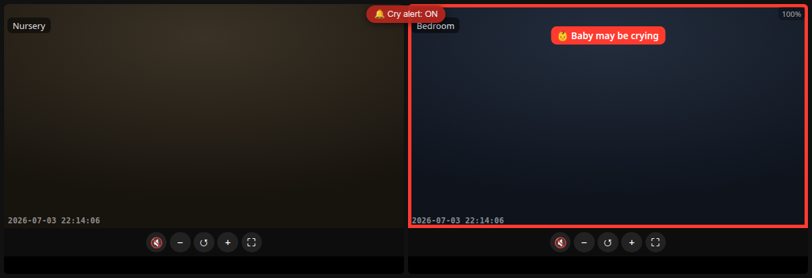

# crywatch 👶

[English](README.md) | 繁體中文



<sub>*格線檢視,Bedroom 鏡頭觸發哭聲警報(示範 — 佔位畫面)。*</sub>

一套私有、自架的嬰兒監視器,而且**真的能分辨「在哭」和「只是很吵」**。攝影機畫面透過 WebRTC
串到你手機——完全不經過任何廠商雲端——而一個小型 AI 模型只有在**真的聽到嬰兒哭聲**時才推播
(吸塵器、電視、你在講話都不會)。

兩個小元件:

- **`viewer/`** — 零相依的網頁播放器:多鏡頭格線、點擊放大、雙指縮放、手機直式串流、啟動載入
  動畫。透過 WebRTC 與 [go2rtc](https://github.com/AlexxIT/go2rtc) 溝通。
- **`cry-detector/`** — 伺服器端分類器,用 **Google 的 YAMNet**(AudioSet)分析短音訊片段,
  偵測到哭聲就推播 [ntfy](https://ntfy.sh) 通知。**純 CPU,免顯卡。**

---

## 為什麼

市售監視器 App 都要繞廠商雲端——延遲高,而且我不想讓孩子房間的畫面存在別人的伺服器上。而且那些
「智慧」警報通常只是音量門檻,所以**任何**大聲的東西都會觸發。這個專案兩者都解決:完全自架,而且是
**對聲音分類**,不是量音量。

## 架構

```
  IP cameras ──RTSP──> go2rtc ──WebRTC──> browser viewer (phone/desktop, over VPN)
                          │
                          └──RTSP(audio)──> cry-detector ──> YAMNet ──> ntfy push
                                            (short 16kHz clips)         (phone asleep OK)
```

- **go2rtc** 是中樞:從攝影機拉 RTSP,再以 WebRTC 重新提供給瀏覽器(WebRTC 有次秒級延遲,也能
  播攝影機的 PCMA 音訊)。
- **viewer** 是靜態 HTML/JS——放哪都行(go2rtc 可以提供,或任何網頁伺服器)。
- **cry-detector** 只從 go2rtc 拉音訊、分類、再送 ntfy。

## 你需要什麼

- 一台以上的 **RTSP/ONVIF 攝影機**(多數會有主/子兩個串流)。你**觀看**的串流必須是 **H.264**
  ——瀏覽器的 WebRTC 不能播 H.265/HEVC。
- **[go2rtc](https://github.com/AlexxIT/go2rtc)**(Docker)。
- **[ntfy](https://github.com/binwiederhier/ntfy)** 做推播(自架或用 ntfy.sh),手機裝 ntfy App。
- **Docker**(跑哭聲偵測器)。
- **選用——遠端連線:** 只有當你想在**外面看即時畫面**時才需要 VPN(**Tailscale** 最簡單,或
  WireGuard)。哭聲推播不需要它,而且**千萬別**把這些沒有驗證的埠 port-forward 到公網
  (見 [SECURITY.md](SECURITY.md))。

## 最小安裝(免 VPN、免 Frigate)

你**不需要** Frigate(另一套 NVR)或 VPN 就能用。唯一的硬需求是 **攝影機 + go2rtc + Docker + ntfy**。

**在哪能用什麼:**

| 你在哪 | 自架 ntfy(Compose 預設) | 公開 ntfy.sh |
|---|---|---|
| **在家**(同 Wi-Fi)— 即時畫面 + 警報 | ✅ 免 VPN | ✅ 免 VPN |
| **在外** — 哭聲警報 | 🔒 需 VPN | ✅ 免 VPN |
| **在外** — 即時畫面 | 🔒 需 VPN | 🔒 需 VPN |

想在外看即時畫面(或想遠端收自架 ntfy 的警報),請加 VPN——見下方 **遠端連線(Tailscale)**。

- **在家(同 Wi-Fi):** 直接開 `http://<伺服器IP>:1985/multi.html`——免 VPN。
- **在外:** 用行動網路/別的 Wi-Fi 的手機**預設無法**連進你家網路(在 NAT/防火牆後面)。想遠端看
  即時畫面,加 **Tailscale**(伺服器 + 手機都裝、登入同一帳號——約 5 分鐘)。**別**把 go2rtc
  port-forward 到公網,它沒有驗證。
- **哭聲警報——取決於你的 ntfy:** 用**公開的 ntfy.sh**(`NTFY_URL=https://ntfy.sh/<topic>`),
  推播在**任何地方都收得到,免 VPN**。用**自架** ntfy(Compose 預設,留在你的區網)時,手機必須
  連得到它——在家 Wi-Fi 或 VPN 上——才能在外面收到警報。

ntfy 可以用公開的 **ntfy.sh**(選一個難猜的 topic——零設定)或自架。

## 快速開始(Docker Compose)

一鍵拉起整套——go2rtc、播放器、哭聲偵測器、ntfy:

```bash
cp examples/go2rtc.example.yaml go2rtc.yaml   # 填你的相機(IP + 帳密)
cp .env.example .env                          # 設你的 ntfy topic、鏡頭、調校參數
docker compose up -d --build
```

然後開 `http://<伺服器IP>:1985/multi.html?cams=cam1,cam2&labels=Nursery,Bedroom`,並在 ntfy
App 訂閱你的 topic。這樣就好——只需要改兩個檔(`go2rtc.yaml` 填相機、`.env` 填 ntfy topic)。

- 想要零設定推播?刪掉 `docker-compose.yml` 裡的 `ntfy` 服務,並在 `.env` 設
  `NTFY_URL=https://ntfy.sh/<你的獨特topic>`。
- 想手動一個個跑?見下方手動步驟。

## 在 macOS / Windows 上跑(Docker Desktop)

這套是為 **Linux 主機**設計的(NAS、迷你主機、裝 Linux 的舊筆電、Pi 或 VPS)——24 小時的監視器
就該跑在這種機器上。在 **Docker Desktop**(macOS/Windows)上,Docker 跑在一個 Linux VM 裡,所以
`network_mode: host` 指的是那個 VM,不是你的電腦。**哭聲偵測、推播、網頁都沒問題**——只有
**WebRTC 即時畫面**要調,因為 host 網路 + 自動 ICE candidate 到不了瀏覽器。兩個選擇:

**A.(最簡單)開啟 Docker Desktop 的 host networking。** 較新的 Docker Desktop 有
*Settings → Resources → Network → Enable host networking*(beta)。打開後預設的
`docker-compose.yml` 可能就直接能用。

**B. 改用發布埠 + WebRTC candidate:**

1. 在 `docker-compose.yml`,把 `go2rtc` 和 `cry-detector` **兩個**的 `network_mode: host`
   移除,並給 `go2rtc` 發布埠:
   ```yaml
   go2rtc:
     image: alexxit/go2rtc:latest
     ports: ["1984:1984", "8554:8554", "8555:8555/tcp", "8555:8555/udp"]
     volumes:
       - ./go2rtc.yaml:/config/go2rtc.yaml:ro
   ```
2. 在 `go2rtc.yaml`,宣告你電腦的區網 IP 讓瀏覽器連得到 WebRTC:
   ```yaml
   webrtc:
     listen: ":8555"
     candidates:
       - <YOUR_LAN_IP>:8555      # 例如 192.168.1.50:8555
   ```
3. 在 `.env`,把偵測器指向服務名而非 localhost:
   ```
   GO2RTC_RTSP=rtsp://go2rtc:8554
   NTFY_URL=http://ntfy/<your-topic>
   ```

在 Linux 上完全不用這些——host networking 會處理好,所以它是預設。長期運行的監視器,一台小
Linux 機器最省事。

## 安裝(手動,不用 Compose)

### 1. go2rtc + 攝影機

```bash
cp examples/go2rtc.example.yaml go2rtc.yaml   # 編輯:你的相機 IP + 帳密
# 跑 go2rtc(Docker),指向 go2rtc.yaml — 見 go2rtc 文件
```

把串流命名為 `cam1`、`cam1_hd`、`cam2`…(叫什麼都行——跟播放器/偵測器設定對上就好)。

### 2. 播放器

用任何網頁伺服器提供 `viewer/`(或把 go2rtc 的靜態目錄指過去)。然後開:

```
http://<host>:1985/multi.html?cams=cam1,cam2&labels=Nursery,Bedroom
```

- 點一格(⛶)放大並切到 HD 串流;✕ 返回。
- 雙指/滾輪縮放、拖曳平移、🔔 切換瀏覽器內的輕量哭聲閃爍。
- 預設值(串流/標籤、格線→HD 對應)在 `multi.html` 最上面。

`index.html` 是單鏡頭版:`index.html?src=cam1`。

### 3. 哭聲偵測器

```bash
cp .env.example .env        # 編輯 NTFY_URL、GO2RTC_RTSP、CAMS…
set -a; . ./.env; set +a    # 載入
cd cry-detector && ./run.sh # 建 image 並啟動容器
docker logs -f baby-cry-detector
```

手機上:裝 **ntfy** App、指向你的伺服器、訂閱 `NTFY_URL` 裡的 topic。手機睡著也收得到。

## 遠端連線(選用 — Tailscale,約 5 分鐘)

上面所有東西在家裡 Wi-Fi 上免 VPN 就能用。想在**外面看即時畫面**,用
[Tailscale](https://tailscale.com)(底層是 WireGuard,但零設定)把伺服器和手機放進同一個私有網路:

1. **伺服器上**——安裝並啟動:
   ```bash
   curl -fsSL https://tailscale.com/install.sh | sh
   sudo tailscale up
   ```
   記下它的 Tailscale 位址(`100.x.y.z`,或像 `myserver` 的 MagicDNS 名稱)。
2. **手機上**——裝 Tailscale App,用**同一帳號**登入。
3. 在任何地方開 `http://<tailscale位址>:1985/multi.html`。
4. *(建議)* 把 `CRY_CLICK_URL` 設成那個 Tailscale 位址,這樣點哭聲通知就能直接開鏡頭,人在
   外面也行。

> **別**把 go2rtc port-forward 到公網——它沒有驗證。把它藏在 Tailscale(或 WireGuard)後面才
> 安全。想用自架 **WireGuard**?一樣的概念、設定多一點——本文不涵蓋。

## 調校

用 `CRY_LOG=1` 看即時分類(`docker logs -f baby-cry-detector`):

```
[Nursery] cry=0.00 rms=-72dB top='(silence)' streak=0
[Bedroom] cry=1.00 rms=-25dB top='Crying, sobbing' streak=2   -> push!
```

| 變數 | 預設 | 意義 |
|---|---|---|
| `CRY_PROB` | `0.4` | 觸發的哭聲機率 0–1。誤報就調高,漏報就調低。 |
| `CRY_SUSTAIN_SAMPLES` | `2` | 警報前需連續幾次哭聲樣本 |
| `CRY_COOLDOWN` | `60` | 兩次警報間的最短秒數 |
| `CRY_RMS_GATE_DB` | `-60` | 低於此音量就跳過模型(視為靜音) |
| `CRY_SAMPLE_SEC` | `2.0` | 每次取樣的音訊秒數 |

在我的測試裡,真實嬰兒哭聲得分 **0.5–1.0**;講話大約峰值 **0.27**;而咳嗽/拍手/狗/笑/鬧鐘——
以及一台**吸塵器**(全部裡面最大聲的)——都是 **~0.00**。這就是重點:大聲 ≠ 在哭。

## 硬體

哭聲偵測器是**純 CPU**(CPU 版 TensorFlow)——一台 NUC 或 NAS 就夠。只有當你另外要把 4K H.265
攝影機轉成 H.264 給瀏覽器時才用得到 GPU(本文不涵蓋——見 go2rtc 的 `ffmpeg:` 來源,或
mediamtx + NVENC 中繼)。

## 安全

請讀 **[SECURITY.md](SECURITY.md)**。簡短版:永遠不要 commit 機密(相機密碼、`.conf`/`.key`、
token、資料庫——都已 gitignore),真實設定留在本機(`go2rtc.yaml`、`.env`),而且一切都走 VPN、
不要 port-forward。

## 備註

當作週末專案做的,大部分是用 [Claude Code](https://www.anthropic.com/claude-code) 兜出來的——
包括 WebRTC 競態條件的 debug 和接上音訊模型。使用了 Google 的
[YAMNet](https://tfhub.dev/google/yamnet/1)。

## 授權

[Apache License 2.0](LICENSE)。
